# Resident-Evil-9-Requiem-UA

## .msg файли в хронологічній послідовності

|  №  | NUM |          Файл          |
|:---:|:---:|:------------------------|
|  1  | 009 | `dialog_hotel3.msg.23`  |
|  2  | 023 | `dialog_streetms.msg.23`|
|  3  | 010 | `dialog_mange.msg.23`   |
|  4  | 013 | `dialog_mangm3.msg.23`  |
|  5  | 018 | `dialog_manlh.msg.23`   |

---

## Resident Evil 9 Audio — діалоги (кількість реплік)

Розібрані `.wav` файли діалогів знаходяться тут:
`002_GAME_Unpacker/natives/stm/streaming/sound/wwise/dialogue`

Кожна папка відповідає одному звуковому банку (`*.spck.1.x64`), а число під нею — кількість пронумерованих реплік (`.wav`) усередині.

```mermaid
flowchart LR
    Root[🎙️ Resident Evil 9 Audio]

    Root --> ch0100[ch0100_dialogue]
    ch0100 --> n_ch0100[260]

    Root --> ch0200[ch0200_dialogue]
    ch0200 --> n_ch0200[463]

    Root --> ch0200chp1[ch0200_dialogue_chp1]
    ch0200chp1 --> n_ch0200chp1[37]

    Root --> ch0300[ch0300_dialogue]
    ch0300 --> n_ch0300[43]

    Root --> ch0600[ch0600_dialogue]
    ch0600 --> n_ch0600[41]

    Root --> ch0900[ch0900_dialogue]
    ch0900 --> n_ch0900[5]

    Root --> ch1300[ch1300_dialogue]
    ch1300 --> n_ch1300[16]

    Root --> ch1510[ch1510_dialogue]
    ch1510 --> n_ch1510[5]

    Root --> ch1800[ch1800_dialogue]
    ch1800 --> n_ch1800[8]

    Root --> ch2000[ch2000_dialogue]
    ch2000 --> n_ch2000[46]

    Root --> ch2100[ch2100_dialogue]
    ch2100 --> n_ch2100[26]

    Root --> ch4000[ch4000_dialogue]
    ch4000 --> n_ch4000[413]

    Root --> ch4030[ch4030_dialogue]
    ch4030 --> n_ch4030[8]

    Root --> ch4100[ch4100_dialogue]
    ch4100 --> n_ch4100[147]

    Root --> ch5100[ch5100_dialogue]
    ch5100 --> n_ch5100[32]

    Root --> ch8000[ch8000_dialogue]
    ch8000 --> n_ch8000[4]

    Root --> ch9906[ch9906_dialogue]
    ch9906 --> n_ch9906[2]

    Root --> ch9910[ch9910_dialogue]
    ch9910 --> n_ch9910[1]

    Root --> ch9911[ch9911_dialogue]
    ch9911 --> n_ch9911[4]

    Root --> ch9912[ch9912_dialogue]
    ch9912 --> n_ch9912[6]

    Root --> ch9914[ch9914_dialogue]
    ch9914 --> n_ch9914[2]

    Root --> ch9915[ch9915_dialogue]
    ch9915 --> n_ch9915[2]

    Root --> ch9916[ch9916_dialogue]
    ch9916 --> n_ch9916[18]

    Root --> ch9917[ch9917_dialogue]
    ch9917 --> n_ch9917[1]

    Root --> ch9945[ch9945_dialogue]
    ch9945 --> n_ch9945[1]

    classDef root fill:#2b2d42,stroke:#1a1c2c,color:#ffffff,font-weight:bold;
    classDef c0 fill:#f7d4d4,stroke:#c32222,color:#1a1a1a;
    classDef c1 fill:#f7dcd4,stroke:#c34822,color:#1a1a1a;
    classDef c2 fill:#f7e5d4,stroke:#c37022,color:#1a1a1a;
    classDef c3 fill:#f7edd4,stroke:#c39622,color:#1a1a1a;
    classDef c4 fill:#f7f6d4,stroke:#c3be22,color:#1a1a1a;
    classDef c5 fill:#f0f7d4,stroke:#a3c322,color:#1a1a1a;
    classDef c6 fill:#e8f7d4,stroke:#7dc322,color:#1a1a1a;
    classDef c7 fill:#dff7d4,stroke:#55c322,color:#1a1a1a;
    classDef c8 fill:#d7f7d4,stroke:#30c322,color:#1a1a1a;
    classDef c9 fill:#d4f7da,stroke:#22c33d,color:#1a1a1a;
    classDef c10 fill:#d4f7e2,stroke:#22c363,color:#1a1a1a;
    classDef c11 fill:#d4f7ea,stroke:#22c388,color:#1a1a1a;
    classDef c12 fill:#d4f7f3,stroke:#22c3b0,color:#1a1a1a;
    classDef c13 fill:#d4f3f7,stroke:#22b0c3,color:#1a1a1a;
    classDef c14 fill:#d4eaf7,stroke:#2288c3,color:#1a1a1a;
    classDef c15 fill:#d4e2f7,stroke:#2263c3,color:#1a1a1a;
    classDef c16 fill:#d4daf7,stroke:#223dc3,color:#1a1a1a;
    classDef c17 fill:#d7d4f7,stroke:#3022c3,color:#1a1a1a;
    classDef c18 fill:#dfd4f7,stroke:#5522c3,color:#1a1a1a;
    classDef c19 fill:#e8d4f7,stroke:#7d22c3,color:#1a1a1a;
    classDef c20 fill:#f0d4f7,stroke:#a322c3,color:#1a1a1a;
    classDef c21 fill:#f7d4f6,stroke:#c322be,color:#1a1a1a;
    classDef c22 fill:#f7d4ed,stroke:#c32296,color:#1a1a1a;
    classDef c23 fill:#f7d4e5,stroke:#c32270,color:#1a1a1a;
    classDef c24 fill:#f7d4dc,stroke:#c32248,color:#1a1a1a;

    class Root root;
    class ch0100,n_ch0100 c0;
    class ch0200,n_ch0200 c1;
    class ch0200chp1,n_ch0200chp1 c2;
    class ch0300,n_ch0300 c3;
    class ch0600,n_ch0600 c4;
    class ch0900,n_ch0900 c5;
    class ch1300,n_ch1300 c6;
    class ch1510,n_ch1510 c7;
    class ch1800,n_ch1800 c8;
    class ch2000,n_ch2000 c9;
    class ch2100,n_ch2100 c10;
    class ch4000,n_ch4000 c11;
    class ch4030,n_ch4030 c12;
    class ch4100,n_ch4100 c13;
    class ch5100,n_ch5100 c14;
    class ch8000,n_ch8000 c15;
    class ch9906,n_ch9906 c16;
    class ch9910,n_ch9910 c17;
    class ch9911,n_ch9911 c18;
    class ch9912,n_ch9912 c19;
    class ch9914,n_ch9914 c20;
    class ch9915,n_ch9915 c21;
    class ch9916,n_ch9916 c22;
    class ch9917,n_ch9917 c23;
    class ch9945,n_ch9945 c24;
```

Загалом: **1591** репліка.

